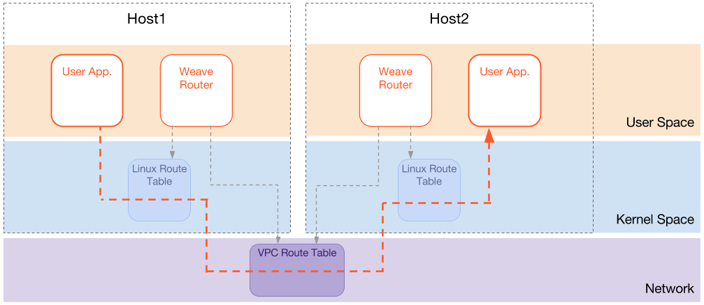

If your container infrastructure is running entirely within Amazon Web Services (AWS) 
Elastic Compute Cloud (EC2), then you can enable AWS-VPC mode with Weave Net. In AWS-VPC mode, 
containers are networked without using an overlay and allows network speeds 
close to that of the underlying network.

With AWS-VPC enabled, Weave Net manages IP addresses and connects
containers to the network as usual, but instead of wrapping each packet and
sending it to its destination, Weave Net instructs the AWS network
router with the ranges of container IP addresses and the instances 
on which they live. 



###Configuring EC2 Instances to use Weave AWS-VPC Mode

First, your AWS instances need to be given write access to the route
table via its
[IAM Role](http://docs.aws.amazon.com/AWSEC2/latest/UserGuide/iam-roles-for-amazon-ec2.html).
If you have an existing IAM Role then extend it, otherwise create a
new role. The role must have a
[policy](http://docs.aws.amazon.com/AWSEC2/latest/UserGuide/iam-policies-for-amazon-ec2.html)
attached which allows the following
[actions](http://docs.aws.amazon.com/AWSEC2/latest/APIReference/API_Operations.html):


```
{
    "Version": "2012-10-17",
    "Statement": [
        {
            "Effect": "Allow",
            "Action": [
                "ec2:CreateRoute",
                "ec2:DeleteRoute",
                "ec2:ReplaceRoute",
                "ec2:DescribeRouteTables",
                "ec2:DescribeInstances"
            ],
            "Resource": [
                "*"
            ]
        }
    ]
}
```

Secondly, your Security Group must allow network traffic between instances.  
You must open TCP port 6783 which is the port that Weave Net uses to manage the network and also 
allow any ports which your own containers use. 

>>**Remember:** There is no network overlay in this mode, and so, IP packets with container
addresses will flow over the AWS network unmodified.

Finally, since Weave will be operating with IP addresses outside of the 
range allocated by Amazon, you must disable "Source/Destination check" on each machine.

###Using AWS-VPC Mode

Launch Weave Net with the `--awsvpc` flag:

    $ weave launch --awsvpc [other hosts]

 >>**Note:** You will still need to supply the names or IP addresses of other hosts in
your cluster.

###Present Limitations

- AWS-VPC mode does not inter-operate with other Weave Net modes; it
  is all or nothing.  In this mode, all hosts in a cluster must be AWS
  instances. (We hope to ease this limitation in future.)
- The `weave launch` command waits until the
  [IP address manager](/site//operational-guide/concepts.md#ip-address-manager-ipam)
  is ready, i.e. until after this peer has been able to make contact
  with other peers and confirm that it has joined the cluster the
  bridge.  Without AWS-VPC, `weave launch` returns without waiting.
- The AWS network does not support multicast.
- The number of hosts in a cluster is limited by the maximum size of
  your AWS route table.  This is limited to 50 entries though you
  can request an increase to 100 by contacting Amazon.
- All of your containers must be on the same network, with no subnet
  isolation. (We hope to ease this limitation in future.)

###Packet size (MTU)

The Maximum Transmission Unit, or MTU, is the technical term for the
limit on how big a single packet can be on the network. Weave Net
defaults to 1410 bytes. This default works across almost all networks, but for better 
performance you can set it to a larger MTU size. 

The AWS network supports packets of up to 9000 bytes.  

In AWS-VPC mode you can run the following:

    $ WEAVE_MTU=9000 weave launch --awsvpc host2 host3

**See Also**

 * [Using Weave Net](/site/using-weave.md)
 * [Performance measurements](/blog/weave-docker-networking-performance-aws-vpc/)

(that last blog post doesn't exist yet)
